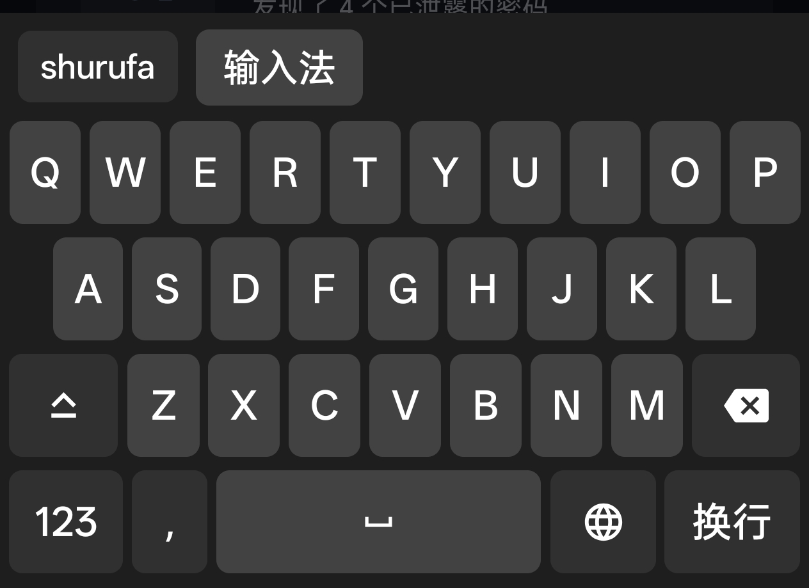
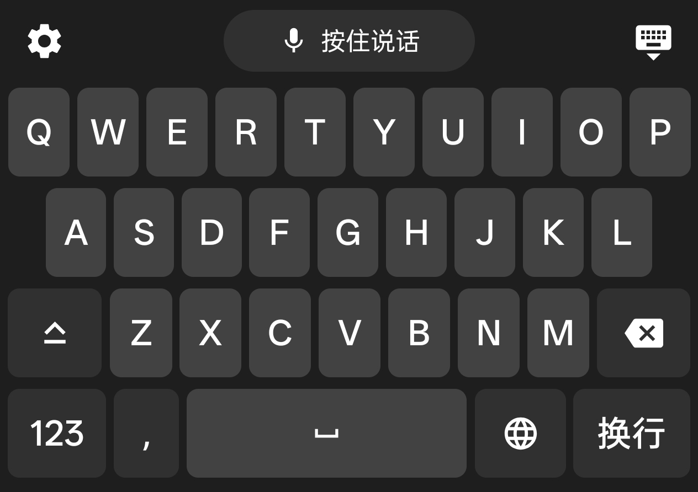
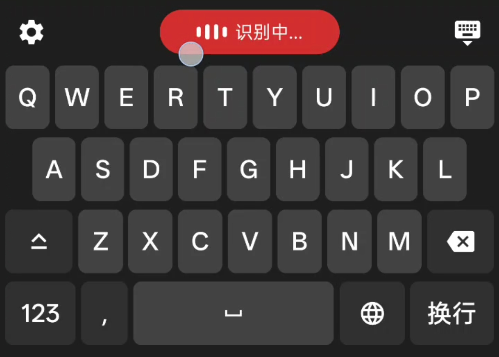

<h1 align="center">
  
  <span>豆沙包输入法 (豆包输入法同款语音引擎)</span>
</h1>

一款基于 **豆包AI语音** 流式解析 的 Android 语音输入键盘,支持语音实时转文字和拼音输入法

> 由于我之前并未接触过 Android 原生开发,但之前对接过豆包语音API,所以选择这个赛题,
> 在Claude老师的帮助下完成了这个项目,恳请评委们多多包涵,希望能进入下一轮面试!


## 演示视频
<div align="center">
  <video src="https://github.com/user-attachments/assets/a81baf94-6f10-4c54-8721-59bda937dd3e" width="300" controls autoplay loop muted></video>
</div>

## 功能特点

- **语音输入** - 按住说话按钮,实时语音识别并转换为文字
- **拼音输入** - 支持拼音输入,智能联想中文候选词

<table align="center">
  <tr>
    <td></td>
    <td></td>
    <td></td>
  </tr>
</table>

## 系统要求

- Android 14 (API 34) 或更高版本
- 联网权限(用于语音识别)
- 麦克风权限(用于语音输入)

## 项目结构

```
aivoiceime/
├── app/src/main/java/cn/sanbei101/aivoiceime/
│   ├── MainActivity.kt           # 启动页面,包含输入法启用引导
│   ├── AiVoiceImeService.kt       # 输入法核心服务
│   ├── VoiceInputManager.kt       # 语音输入生命周期管理
│   ├── KeyboardViewModel.kt       # 键盘状态 ViewModel
│   ├── KeyboardScreen.kt          # Jetpack Compose 键盘界面
│   ├── asr/                       # 语音识别模块
│   │   ├── AsrWsClient.kt         # ByteDance ASR WebSocket 客户端
│   │   ├── AudioRecorder.kt       # PCM 音频录制 (16kHz)
│   │   ├── Request.kt             # 协议请求构建
│   │   ├── Response.kt           # ASR 响应解析
│   │   └── Common.kt             # GZIP 压缩、WAV 工具
│   ├── pinyin/                    # 拼音输入法模块
│   │   ├── PinyinDatabase.kt      # Room 拼音词典数据库
│   │   ├── PinyinDao.kt          # 候选词查询 DAO
│   │   ├── PinyinEntry.kt        # 拼音词条实体
│   │   └── PinyinCandidate.kt     # 候选词结果
│   └── ui/theme/                  # Compose 深色主题
├── app/src/main/assets/databases/
│   └── pinyin.db                  # 预置拼音词典 (约 1.5MB)
└── app/build.gradle.kts
```

## 技术架构

- **输入法框架** - 继承 Android `InputMethodService`
- **UI 层** - Jetpack Compose 实现全键盘界面
- **架构模式** - MVVM (ViewModel + StateFlow)
- **语音识别** - ByteDance ASR API, WebSocket 实时传输
- **拼音词典** - Room 数据库,本地快速查询
- **异步处理** - Kotlin Coroutines + Flow

## 核心组件

| 组件                  | 说明                            |
|---------------------|-------------------------------|
| `AiVoiceImeService` | 输入法主服务,处理键盘生命周期               |
| `VoiceInputManager` | 管理语音录制和识别流程                   |
| `AsrWsClient`       | WebSocket 连接 ByteDance ASR 服务 |
| `AudioRecorder`     | 16kHz 单声道 PCM 音频录制            |
| `PinyinDatabase`    | 拼音词典 Room 数据库                 |
| `KeyboardViewModel` | 管理候选词、录音状态、音量等状态              |

## 快速开始

### 1. 构建项目

```bash
./gradlew assembleDebug
```

### 2. 安装 APK

```bash
adb install app/build/outputs/apk/debug/app-debug.apk
```

### 3. 启用输入法

1. 打开 **设置** → **系统** → **键盘与输入法**
2. 找到 **AI Voice IME** 并启用
3. 将其设为默认键盘

### 4. 使用输入法

- 切换到 AI Voice IME 后,按 **按住说话** 按钮开始语音输入
- 或切换到拼音模式,输入拼音获取候选词

## 权限说明

| 权限             | 用途                   |
|----------------|----------------------|
| `RECORD_AUDIO` | 录制语音进行语音识别           |
| `INTERNET`     | 连接 ByteDance ASR API |

## 依赖库

| 库                     | 版本         |
|-----------------------|------------|
| Jetpack Compose BOM   | 2026.05.01 |
| OkHttp                | 5.3.2      |
| Kotlinx Serialization | 1.11.0     |
| Room                  | 2.8.4      |
| Kotlin Coroutines     | 1.11.0     |
| Lifecycle Runtime     | 2.10.0     |
